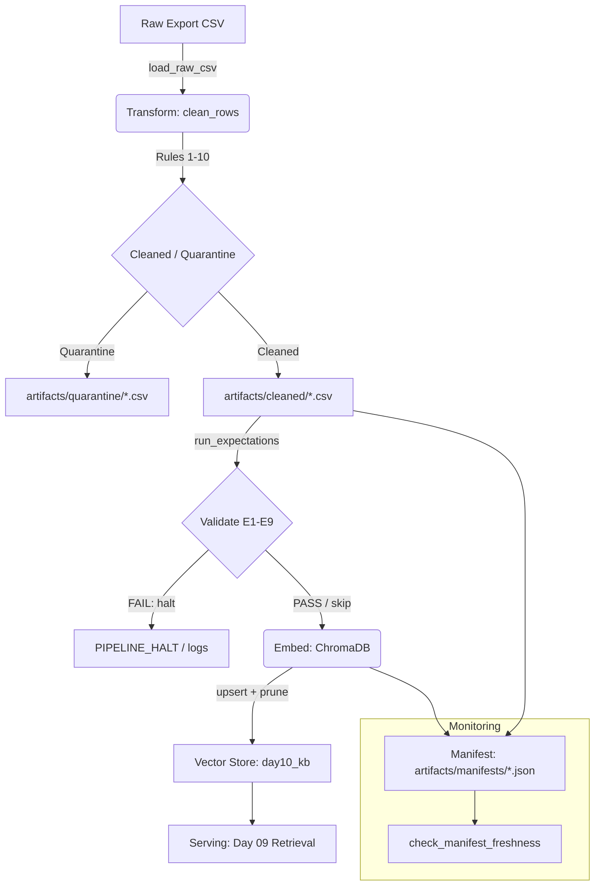

# Kiến trúc pipeline — Lab Day 10

**Nhóm:** Nhóm XX
**Cập nhật:** 2026-04-15

---

## 1. Sơ đồ luồng (bắt buộc có 1 diagram: Mermaid / ASCII)

- **Freshness**: Đo tại bước cuối cùng bằng cách so sánh `latest_exported_at` trong manifest với `now()`.
- **Run ID**: Sinh tự động theo format `YYYY-MM-DDTHH-MZ` hoặc truyền qua `--run-id`.
- **Quarantine**: Lưu trữ các records lỗi (unknown doc, format sai, stale version) kèm `reason` để debug.

---

## 2. Ranh giới trách nhiệm

| Thành phần | Input | Output | Owner nhóm |
|------------|-------|--------|--------------|
| **Ingest** | `data/raw/policy_export_dirty.csv` | List[Dict] (Raw rows) | Nhóm trưởng |
| **Transform** | Raw rows | Cleaned CSV + Quarantine CSV | Member 2 (M2) |
| **Quality** | Cleaned rows | ExpectationResults + Halt signal | Member 2 (M2) |
| **Embed** | Cleaned CSV | ChromaDB Collection (`day10_kb`) | Nhóm trưởng |
| **Monitor** | Manifest JSON | Freshness Status (PASS/FAIL) | Member 2 (M2) |

---

## 3. Idempotency & rerun

- **Strategy**: Sử dụng `upsert` dựa trên `chunk_id`.
- **Chunk ID**: Được tạo từ `hash(doc_id | chunk_text | sequence)` đảm bảo tính duy nhất và ổn định (stable).
- **Pruning**: Cơ chế `embed_prune_removed` trong `cmd_embed_internal` sẽ xóa các `chunk_id` cũ trong collection không xuất hiện trong bản cleaned của run hiện tại. Điều này biến vector store thành một bản snapshot trung thực của dữ liệu đã qua xử lý.
- **Rerun**: Có thể chạy lại thoải mái mà không lo duplicate vector nhờ cơ chế `upsert`.

---

## 4. Liên hệ Day 09

- Pipeline này cung cấp/làm mới corpus cho retrieval trong `day09/lab` thông qua việc cập nhật ChromaDB collection chung.
- Tên collection mặc định là `day10_kb` (cấu hình qua `.env` hoặc biến môi trường `CHROMA_COLLECTION`).
- Retrieval system của Day 09 chỉ cần trỏ vào đúng `CHROMA_DB_PATH` và `CHROMA_COLLECTION` để sử dụng dữ liệu mới nhất.

---

## 5. Rủi ro đã biết

- **Pydantic Dependency**: Nếu không cài `pydantic`, bước validate schema (E9) sẽ bị skip (chỉ warn).
- **Malformed CSV**: Parser của Python `csv` module có thể lỗi nếu file raw bị corrupt nặng.
- **SLA False Positive**: Nếu source system export chậm, pipeline sẽ báo `FAIL` freshness dù code vẫn chạy đúng.
- **Embedding Model Drift**: Nếu thay đổi `EMBEDDING_MODEL` giữa các lần run mà không clear DB, kết quả search sẽ bị sai lệch (vector không tương thích).
